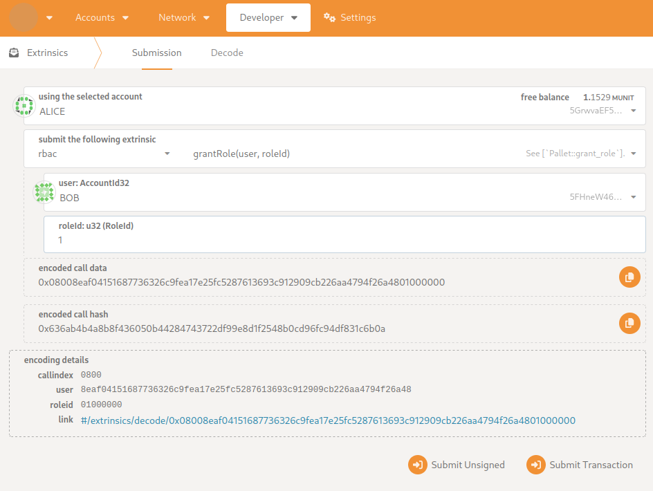
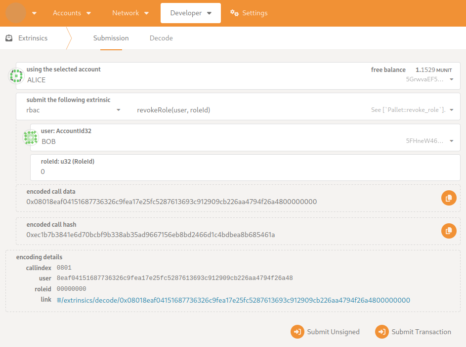

# Role-based Access Control Pallet

## Overview

The Role-based Access Control allows other pallets to build their role systems and enforce restrictions over their generics.

## Interface

### Dispatchable functions

* `grant_role` - grants a role to the user
* `revoke_role` - revokes a role from the user

### Public functions

* `add_role` - creates a new role
* `authorize` - challenges a user against the list of roles
* `preassign_role` - assign user to the role prior to any block

## Usage

### Role system example

For example let's take a role system for some press release pallet.

We have three kinds of users:

* Admin: starts and finishes a new press release, manages the whole lifecycle. Can be granted only by other Admin.
* Moderator: approves or rejects the writings for the press-release. Can be granted only be Admins.
* Writer: creates and edits writing pieces. Can be granted by Admins and Moderators.

Later in the code sample I will show how we can code these roles.

### Prerequisites

Import the traits from pallet to your pallet, create a type in config to initiate it from the runtime crate.

### Initialize roles

You should initialize your roles from `on_runtime_upgrade` hook (if your chain is already running) or from `BuildGenesisConfig` trait implementation. Don't forget to save the `RoleId` that is returned from `add_role` call to use it later for challenges. Add some accounts to start giving out roles through `preassign_role` call.

### Challenging against the role

To challenge user against the role list you should use `authorize` public call. It will return a boolean value as the status of authorization.

### Code sample
```rust
#[frame_support::pallet]
pub mod pallet {
	use super::*;
    use pallet_rbac as rbac;
	use frame_support::pallet_prelude::*;
	use frame_system::pallet_prelude::*;
    use codec::EncodeLike;

	#[pallet::pallet]
	pub struct Pallet<T>(_);

    #[pallet::storage]
    pub type AdminRole<T: Config> = StorageValue<_, T::RoleId, ValueQuery>;
    #[pallet::storage]
    pub type ModeratorRole<T: Config> = StorageValue<_, T::RoleId, ValueQuery>;
    #[pallet::storage]
    pub type WriterRole<T: Config> = StorageValue<_, T::RoleId, ValueQuery>;

	#[pallet::config]
	pub trait Config: frame_system::Config {
        // other fields from config
        type RoleId: MaxEncodedLen + Decode + EncodeLike + TypeInfo + Default + Clone;
        type RoleInfo: rbac::RoleInfo<Self::RoleId>;
        type RBAC: rbac::Authorize<Self::AccountId, Self::RoleId>
			+ rbac::AddRole<Self::RoleId>
			+ rbac::PreassignRole<Self::AccountId, Self::RoleId>;
        type AdminAccount: Get<Self::AccountId>;
    }

 	#[pallet::call]
	impl<T: Config> Pallet<T> {
		#[pallet::weight(0)]
		pub fn start_press_release(origin: OriginFor<T>) -> DispatchResult {
			let sender = ensure_signed(origin)?;
			if !<T::RBAC as rbac::Authorize<T::AccountId, T::RoleId>>::authorize(
				&sender,
				&[AdminRole::<T>::get()],
			) {
				// not authorized
			}
            // authorized
			Ok(())
		}

		#[pallet::weight(0)]
		pub fn submit_writing(origin: OriginFor<T>) -> DispatchResult {
			let sender = ensure_signed(origin)?;
			if !<T::RBAC as rbac::Authorize<T::AccountId, T::RoleId>>::authorize(
				&sender,
				&[AdminRole::<T>::get(), ModeratorRole::<T>::get(), WriterRole::<T>::get()],
			) {
				// not authorized
			}
            // authorized
			Ok(())
		}

		#[pallet::weight(0)]
		pub fn accept_writing(origin: OriginFor<T>) -> DispatchResult {
			let sender = ensure_signed(origin)?;
			if !<T::RBAC as rbac::Authorize<T::AccountId, T::RoleId>>::authorize(
				&sender,
				&[AdminRole::<T>::get(), ModeratorRole::<T>::get()],
			) {
				// not authorized
			}
            // authorized
			Ok(())
		}
	}

    #[pallet::hooks]
	impl<T: Config> Hooks<BlockNumberFor<T>> for Pallet<T> {
        fn on_runtime_upgrade() -> Weight {
			let admin_role_id =
				<T::RBAC as rbac::AddRole<T::RoleId>>::add_role("admin".as_bytes(), &[], true)
					.expect("incorrect role created");
			AdminRole::<T>::set(admin_role_id.clone());
			let moderator_role_id =
				<T::RBAC as rbac::AddRole<T::RoleId>>::add_role("moderator".as_bytes(), &[admin_role_id], false)
					.expect("incorrect role created");
			ModeratorRole::<T>::set(moderator_role_id.clone());
			let writer_role_id =
				<T::RBAC as rbac::AddRole<T::RoleId>>::add_role(
					"writer".as_bytes(),
					&[admin_role_id, moderator_role_id], 
					false
				).expect("incorrect role created");
			WriterRole::<T>::set(writer_role_id.clone());
			<T::RBAC as rbac::PreassignRole<T::AccountId, T::RoleId>>::preassign_role(
				T::AdminAccount::get(),
				admin_role_id,
			)
			.expect("there is some problem with setup");
		    Weight::zero()
	    }
    }
} 
```

### Granting and revoking roles.

For this you will need to call the a dispatchable function (e.g. extrinsic) from any client of your chain. Here are the screenshots with examples of how you can do it ([polkadot app](https://polkadot.js.org/apps/) is used to interact with the chain):

* Grant role:


* Revoke role:


## Implementation decision explanation

### Loose coupling

In Substrate there are two ways to make a dependency from one pallet to another. You can either import the `Config` trait and make it a supertrait to your `Config` trait or you can make a trait in the dependency, implement it and create an associated type inside `Config` with a bound of this trait on it where you want to introduce this dependency. In terms of computer science it is called tight and loose coupling. In general loose coupling is considered to be a better practice.

For this pallet I have decided that I will go with the loose coupling.

Tight coupling has some advantages: faster to implement (no need to create traits and think how they will be used), more straightforward implementation in general. If the intention of this pallet was for some proprietary usage, I would have used tight coupling. But for the opensource purposes loose coupling becomes more important because it helps users to avoid the situation when your are locked on some dependency and can't change it without rewriting a big piece of code. That's why I have decided to use it.

### `PreassignRole` trait

This is one of the decisions I don't like. I tried to make a design that would be agnostic to accounts but during the implementation I have noticed a flaw in it. I can't start a role without a first user in it. I have made a quick implementation for it, but in a real project I would have gone back to the design phase and tried to think of a better solution.

## References

I have used a [timestamp pallet](https://github.com/paritytech/polkadot-sdk/tree/master/substrate/frame/timestamp) built by Parity as a reference for the pallet implementation.